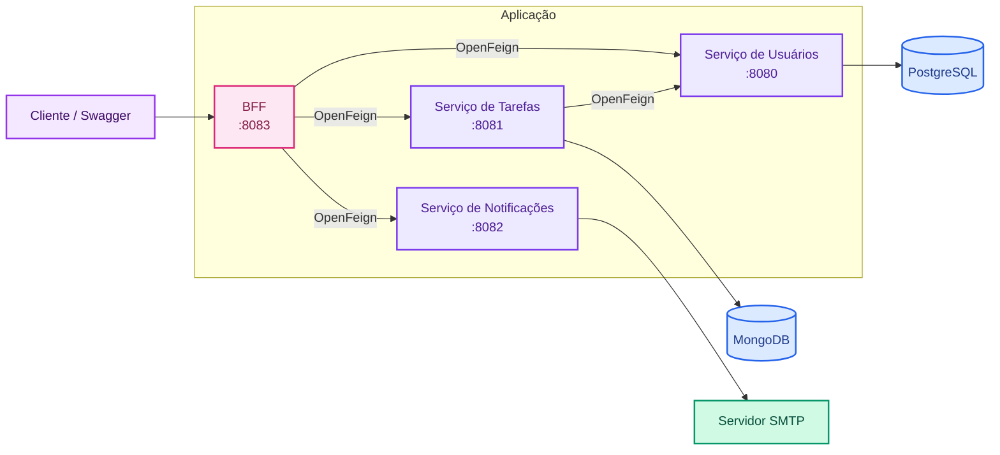

# Agendador de Tarefas com Notificação por E-mail

Sistema backend para gerenciamento e agendamento de tarefas, com autenticação JWT e envio automático de lembretes por e-mail antes dos eventos.

Desenvolvido com **Java 17 e Spring Boot**, o projeto utiliza uma arquitetura baseada em **microsserviços**, comunicação síncrona entre serviços com **OpenFeign** e persistência de dados em **PostgreSQL e MongoDB**.

A aplicação é composta por quatro serviços — **Usuários, Tarefas, Notificações e BFF (Backend for Frontend)** — e todo o ambiente pode ser iniciado localmente com um único comando utilizando **Docker Compose**.

## 🎬 Demonstração

A demonstração abaixo apresenta o fluxo principal da aplicação: autenticação do usuário, criação e agendamento de uma tarefa pelo BFF e recebimento automático da notificação por e-mail antes do evento.

<!-- GIF da demonstração será adicionado aqui -->

## 🏗️ Arquitetura

A aplicação utiliza uma arquitetura baseada em microsserviços, com o **BFF (Backend for Frontend)** como principal ponto de entrada para as operações da API.

A comunicação síncrona entre os serviços é realizada via HTTP utilizando **OpenFeign**, enquanto cada domínio mantém sua própria responsabilidade e persistência.



O **BFF** atua como principal ponto de entrada da aplicação e centraliza a comunicação com os demais serviços. A integração síncrona entre os microsserviços é realizada via **OpenFeign**.

Além das requisições iniciadas pelo cliente, uma rotina agendada no BFF consulta periodicamente tarefas próximas do horário do evento e aciona o serviço de Notificações para o envio dos lembretes por e-mail.

## 🧩 Responsabilidade dos Microsserviços

Cada serviço possui uma responsabilidade específica dentro da aplicação, mantendo separados os domínios de usuários, tarefas e notificações.

| Serviço | Responsabilidade |
|---|---|
| **BFF (Backend for Frontend)** | Atua como ponto de entrada da aplicação, centralizando a autenticação e a comunicação com os demais microsserviços. Também executa a rotina agendada responsável por identificar tarefas próximas e solicitar o envio das notificações. |
| **Usuários** | Responsável pelo cadastro e gerenciamento dos usuários e pela persistência de seus dados em PostgreSQL. |
| **Tarefas** | Gerencia o ciclo de vida das tarefas, incluindo criação, consulta e atualização, com persistência em MongoDB. |
| **Notificações** | Responsável pelo processamento e envio dos lembretes por e-mail através de um servidor SMTP. |

## ✨ Principais Funcionalidades

- 🔐 **Autenticação com JWT** — autenticação de usuários e proteção dos endpoints da aplicação através de tokens JWT.
- 👤 **Gerenciamento de usuários** — cadastro e consulta de usuários, com persistência dos dados em PostgreSQL.
- 📋 **Gerenciamento de tarefas** — criação, consulta, atualização e exclusão de tarefas associadas aos usuários.
- 📅 **Agendamento de eventos** — definição de data e horário para as tarefas, permitindo o processamento automático dos lembretes antes do evento.
- 📧 **Notificações automáticas por e-mail** — identificação periódica de tarefas próximas e envio de lembretes antes do horário do evento.
- 🔄 **Integração entre microsserviços** — comunicação entre os serviços responsáveis por usuários, tarefas e notificações através do BFF.

## 🛠️ Tecnologias

### Backend

- **Java 17** — linguagem principal do projeto.
- **Spring Boot** — desenvolvimento dos microsserviços e APIs REST.
- **Spring Web** — construção dos endpoints HTTP.
- **Spring Data JPA** — persistência dos dados de usuários.
- **Spring Data MongoDB** — persistência das tarefas.
- **Gradle** — gerenciamento de dependências e build das aplicações.

### Segurança e comunicação

- **Spring Security** — configuração de autenticação e proteção dos endpoints.
- **JWT (JSON Web Token)** — autenticação baseada em tokens.
- **OpenFeign** — comunicação HTTP síncrona entre os microsserviços.

### Persistência

- **PostgreSQL** — armazenamento dos dados de usuários.
- **MongoDB** — armazenamento das tarefas agendadas.

### Notificações

- **Spring Mail** — integração com o servidor SMTP para envio dos lembretes por e-mail.
- **Thymeleaf** — geração do conteúdo HTML das mensagens enviadas.

### Infraestrutura

- **Docker** — containerização dos microsserviços.
- **Docker Compose** — orquestração local dos serviços e bancos de dados.

### Documentação da API

- **OpenAPI / Swagger UI** — documentação e execução interativa dos endpoints REST.

## 🐳 Como executar com Docker Compose

Todo o ambiente da aplicação pode ser iniciado localmente através do Docker Compose da raiz do repositório.

### Pré-requisitos

Para executar o projeto, é necessário ter instalado:

- **Git**
- **Docker**
- **Docker Compose**

Não é necessário instalar PostgreSQL ou MongoDB localmente, pois os bancos são executados em containers pelo próprio Docker Compose.

### 1. Clone o repositório

```bash
git clone git@github.com:SteCarvalho87/task-scheduler-microservices.git
cd task-scheduler-microservices
```

### 2. Configure as variáveis de ambiente

O repositório contém um arquivo `.env.example` com as variáveis necessárias para executar a aplicação.

Crie seu arquivo `.env` a partir dele:

```bash
cp .env.example .env
```

Em seguida, preencha o `.env` com suas próprias configurações.

> [!IMPORTANT]
> O arquivo `.env` contém informações sensíveis e não deve ser versionado. Ele já está incluído no `.gitignore`.

As variáveis e suas finalidades estão detalhadas na seção **Variáveis de Ambiente**.

### 3. Inicie o ambiente

Na raiz do repositório, execute:

```bash
docker compose up --build
```

O Docker Compose realizará o build dos microsserviços e iniciará todo o ambiente da aplicação, incluindo:

- BFF
- Serviço de Usuários
- Serviço de Tarefas
- Serviço de Notificações
- PostgreSQL
- MongoDB

Após a inicialização, a API pode ser acessada através do BFF.

### 4. Encerrando o ambiente

Para interromper e remover os containers:

```bash
docker compose down
```

Para remover também os volumes persistidos pelos bancos de dados:

```bash
docker compose down -v
```

> [!WARNING]
> A opção `-v` remove os volumes associados ao ambiente e, consequentemente, os dados persistidos localmente pelo PostgreSQL e MongoDB.

## 🔐 Variáveis de Ambiente

As configurações sensíveis e específicas do ambiente são fornecidas através de variáveis de ambiente.

O arquivo `.env.example` disponível na raiz do projeto contém a estrutura necessária. Para execução local, copie-o para `.env` e substitua os valores de exemplo pelas suas próprias configurações.

| Variável | Finalidade |
|---|---|
| `JWT_SECRET` | Chave utilizada para assinatura e validação dos tokens JWT. |
| `POSTGRES_USER` | Usuário utilizado para conexão com o PostgreSQL. |
| `POSTGRES_PASSWORD` | Senha utilizada para conexão com o PostgreSQL. |
| `ADMIN_EMAIL` | E-mail do usuário técnico utilizado pelo BFF na comunicação entre serviços. |
| `ADMIN_SENHA` | Senha do usuário técnico utilizado pelo BFF. |
| `MAIL_USERNAME` | Conta utilizada para autenticação no servidor SMTP. |
| `MAIL_PASSWORD` | Credencial utilizada na autenticação SMTP. Para Gmail, deve ser utilizada uma senha de app. |
| `MAIL_REMETENTE` | Endereço de e-mail utilizado como remetente das notificações. |
| `MAIL_NOME_REMETENTE` | Nome exibido como remetente dos e-mails enviados pela aplicação. |

> [!NOTE]
> O serviço de notificações está configurado para utilizar SMTP com **STARTTLS na porta 587**. Para utilização com Gmail, é necessário configurar uma conta compatível com autenticação por senha de app.

> [!CAUTION]
> Nunca adicione credenciais reais ao `.env.example` ou ao repositório. O arquivo `.env` está incluído no `.gitignore` e deve permanecer apenas no ambiente local.

## 🧪 Como testar a API pelo Swagger

Com o ambiente iniciado pelo Docker Compose, a API pode ser explorada e testada através do **Swagger UI do BFF**, disponível em:

```text
http://localhost:8083/swagger-ui/index.html
```

O BFF funciona como ponto de entrada da aplicação, permitindo executar pelo Swagger as principais operações disponíveis nos microsserviços.

### 1. Cadastre um usuário

Utilize o endpoint de cadastro de usuários informando os dados solicitados.

Ao preencher o endereço, o campo `estado` deve conter a **sigla da UF com 2 caracteres**, por exemplo:

```text
RJ
```

“Identificadores gerados pela aplicação, como o id de um novo telefone, não devem ser informados durante o cadastro.”

### 2. Realize a autenticação

Após cadastrar o usuário, utilize o endpoint de login com o e-mail e a senha cadastrados.

Em caso de autenticação válida, a aplicação retornará um **token JWT**.

### 3. Autorize as requisições

No Swagger UI:

1. Clique no botão **Authorize**.
2. Informe o token JWT obtido no login.
3. Confirme a autorização.

O token será utilizado nas requisições aos endpoints protegidos.

### 4. Cadastre uma tarefa

Com o usuário autenticado, utilize o endpoint de criação de tarefas.

Informe uma data e horário futuros para o evento. A tarefa será associada ao usuário autenticado e armazenada pelo serviço de Tarefas.

### 5. Consulte as tarefas

Utilize os endpoints de consulta para verificar as tarefas cadastradas e seus respectivos dados.

### 6. Teste a notificação

Para observar o fluxo completo de notificações, cadastre uma tarefa dentro do intervalo processado pela rotina de agendamento.

Quando a tarefa estiver dentro do período configurado, o BFF solicitará ao serviço de Notificações o envio do lembrete para o e-mail do usuário.

> [!NOTE]
> Para que o envio seja realizado, as configurações SMTP do arquivo `.env` devem estar preenchidas corretamente.

## 🔗 Principais Endpoints

As operações da aplicação são disponibilizadas através do **BFF**, que atua como ponto de entrada para os microsserviços.

### Usuários

| Método | Endpoint | Descrição | Autenticação |
|---|---|---|---|
| `POST` | `/usuario` | Cadastra um novo usuário. | Não |
| `POST` | `/usuario/login` | Autentica o usuário e retorna o token JWT. | Não |
| `GET` | `/usuario?email={email}` | Consulta os dados de um usuário pelo e-mail. | JWT |
| `PUT` | `/usuario` | Atualiza os dados do usuário. | JWT |
| `DELETE` | `/usuario/{email}` | Remove um usuário pelo e-mail. | JWT |
| `POST` | `/usuario/endereco` | Adiciona um endereço ao usuário autenticado. | JWT |
| `POST` | `/usuario/telefone` | Adiciona um telefone ao usuário autenticado. | JWT |

### Tarefas

| Método | Endpoint | Descrição | Autenticação |
|---|---|---|---|
| `POST` | `/tarefas` | Cadastra uma nova tarefa para o usuário autenticado. | JWT |
| `GET` | `/tarefas` | Lista as tarefas do usuário autenticado. | JWT |
| `GET` | `/tarefas/eventos` | Consulta tarefas dentro de um período informado. | JWT |
| `PUT` | `/tarefas?id={id}` | Atualiza os dados de uma tarefa. | JWT |
| `PATCH` | `/tarefas?status={status}&id={id}` | Atualiza o status de notificação de uma tarefa. | JWT |
| `DELETE` | `/tarefas?id={id}` | Remove uma tarefa pelo identificador. | JWT |

> [!NOTE]
> Esta tabela apresenta os principais endpoints expostos pelo BFF. A documentação interativa completa, incluindo parâmetros e modelos de requisição e resposta, está disponível através do Swagger UI.

## 📁 Estrutura do Repositório

O projeto está organizado em um **monorepo**, reunindo os quatro microsserviços e a configuração necessária para executar o ambiente completo.

```text
task-scheduler-microservices/
│
├── bff-agendador-tarefas/     # Ponto de entrada e integração entre os serviços
├── usuario/                   # Gerenciamento e autenticação de usuários
├── agendador-tarefas/         # Gerenciamento e persistência das tarefas
├── notificacao/               # Processamento e envio das notificações por e-mail
│
├── docker-compose.yml         # Orquestração de todo o ambiente
├── .env.example               # Modelo das variáveis de ambiente necessárias
├── .gitignore                 # Arquivos e configurações ignorados pelo Git
└── README.md                  # Documentação principal do projeto
```

Cada microsserviço mantém seu próprio código-fonte, dependências, configurações e processo de build, enquanto o `docker-compose.yml` da raiz centraliza a execução integrada da aplicação.

## 💡 Decisões Técnicas e Aprendizados

O projeto evoluiu de uma aplicação mais centralizada para uma arquitetura baseada em microsserviços. Durante essa evolução, algumas decisões foram tomadas com o objetivo de separar responsabilidades, experimentar diferentes estratégias de persistência e compreender os desafios introduzidos por sistemas distribuídos.

### Separação em microsserviços

Os domínios de **usuários, tarefas e notificações** foram separados em serviços independentes, cada um responsável por uma parte específica da aplicação.

Essa evolução permitiu praticar separação de responsabilidades e evidenciou que distribuir uma aplicação não significa apenas separar o código: surgem também novos desafios relacionados à comunicação, autenticação, configuração e execução integrada dos serviços.

### Persistência adequada ao contexto de cada serviço

O serviço de Usuários utiliza **PostgreSQL**, com Spring Data JPA, enquanto o serviço de Tarefas utiliza **MongoDB**.

A escolha permitiu trabalhar com dois modelos de persistência dentro da mesma arquitetura: dados relacionais no domínio de usuários, que possui informações relacionadas como endereços e telefones, e persistência documental no domínio de tarefas.

Mais do que utilizar tecnologias diferentes, o principal aprendizado foi avaliar a persistência de acordo com o contexto e o modelo de dados de cada serviço.

### BFF como ponto de entrada

Com a separação dos microsserviços, foi criado um **BFF (Backend for Frontend)** para fornecer um ponto de entrada centralizado para a aplicação.

O BFF coordena as chamadas aos serviços internos e evita que o cliente precise conhecer diretamente a localização e os contratos de cada microsserviço.

### Comunicação síncrona com OpenFeign

A comunicação atual entre os microsserviços ocorre de forma síncrona através de **APIs REST**, utilizando **OpenFeign**.

Essa abordagem simplifica as integrações necessárias no estágio atual do projeto, mas também evidencia o acoplamento temporal existente na comunicação síncrona. Como evolução, alguns fluxos poderão ser explorados com comunicação assíncrona e mensageria.

### Ambiente integrado com Docker Compose

Cada aplicação foi containerizada e o ambiente passou a ser orquestrado por um único **Docker Compose** localizado na raiz do repositório.

Essa configuração permite iniciar os quatro serviços, PostgreSQL e MongoDB de forma integrada, reduzindo a dependência de configurações locais e tornando o ambiente mais simples de reproduzir.

Durante essa etapa, um dos principais aprendizados foi compreender a diferença entre comunicação através de `localhost` e comunicação entre containers utilizando os nomes dos serviços dentro da rede Docker.

## 🚀 Próximas Evoluções

O projeto continuará evoluindo a partir de pontos identificados durante o desenvolvimento e a integração dos microsserviços.

- [ ] **Integração contínua com GitHub Actions** — automatizar build e testes do monorepo a cada alteração.
- [ ] **Melhoria do tratamento de erros** — padronizar as respostas da API com tratamento global de exceções e mensagens mais representativas dos erros de negócio.
- [ ] **Evolução da documentação OpenAPI** — adicionar descrições, exemplos, restrições de campos e possíveis respostas aos endpoints apresentados pelo Swagger.
- [ ] **Revisão dos DTOs de entrada e saída** — tornar os contratos da API mais específicos e evitar a exposição de campos que não devem ser informados pelo cliente.
- [ ] **Comunicação assíncrona** — explorar mensageria em fluxos que possam se beneficiar de menor acoplamento entre os microsserviços.
- [ ] **Revisão da rotina de agendamento** — avaliar a extração da responsabilidade de processamento das notificações atualmente executada pelo BFF.
- [ ] **Ampliação da cobertura de testes** — adicionar testes automatizados para os principais fluxos e integrações da aplicação.

## 👩‍💻 Autora

Desenvolvido por **Stephanie Carvalho** como projeto de portfólio e aprofundamento prático em desenvolvimento **Java Backend**, explorando arquitetura de microsserviços, segurança, persistência, integração entre serviços e containerização.

- 💼 [LinkedIn](https://www.linkedin.com/in/steph-carvalho)
- 🐙 [GitHub](https://github.com/SteCarvalho87)